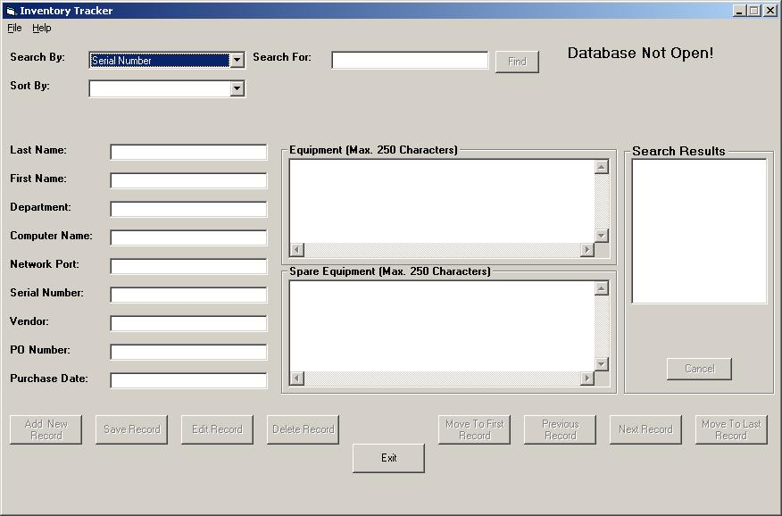



## Inventory Tracker\.

### Description

This is a database application. It stores information for keeping track of company inventory. The database is empty, so you will have to populate it yourself
 
### More Info
 
Input data.

View data.

             |
---                |---
**Submitted On**   |2002-04-25 17:02:16
**By**             |[Paul Konchar](https://github.com/Planet-Source-Code/PSCIndex/blob/master/ByAuthor/paul-konchar.md)
**Level**          |Beginner
**User Rating**    |4.3 (34 globes from 8 users)
**Compatibility**  |VB 6\.0
**Category**       |[Databases/ Data Access/ DAO/ ADO](https://github.com/Planet-Source-Code/PSCIndex/blob/master/ByCategory/databases-data-access-dao-ado__1-6.md)
**World**          |[Visual Basic](https://github.com/Planet-Source-Code/PSCIndex/blob/master/ByWorld/visual-basic.md)
**Archive File**   |[Inventory\_758684252002\.zip](https://github.com/Planet-Source-Code/paul-konchar-inventory-tracker__1-34114/archive/master.zip)

